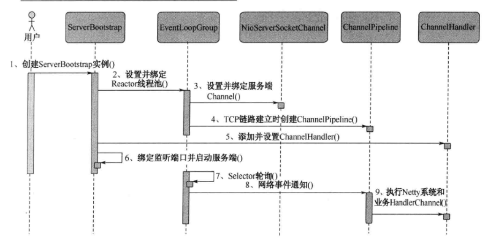

### Netty服务创建时时序图




#### 步骤1：	

​	创建ServerBootstrap实例。它是Netty服务端启动辅助类，提供了一系列的方法用于设置服务端启动的相关参数。底层通过门面模式对各种能力进行抽象和封装，这些做是让我们不需要跟过多的底层API打交道。

#### 步骤2：

​	设置绑定Reactor线程池。Netty的Reactor线程池是EventLoopGroup，它实际就是EventLoop的数组。EventLoop的职责是处理所有注册到本线程多路复用器Selector上Channel，Selector的轮询操作由绑定的EventLoop线程run方法驱动，在一个循环体内循环执行。而EventLoop的职责不仅仅是处理网络I/O事件，自定义的Task和定时任务Task也统一由EventLoop负责处理，这样线程模型就实现了统一。从调度层面看，也不存在从EventLoop线程中再启动其他类型的线程用于异步执行另外的任务，这样就避免了多线程并发操作和锁的竞争，提升了I/O线程的处理和调度性能。

#### 步骤3：

​	设置并绑定服务端Channel。作为NIO服务端，需要创建ServerSocketChannel，Netty对原生的NIO类库进行了封装，对应实现是NioServerSocketChannel，对于用户而言，不需要关心服务端Channel的底层实现细节和工作原理，只需要指定具体使用哪种服务端Channel即可。因此，Netty的ServerBootstrap方法提供了channel方法用于指定服务端Channel的类型。Netty通过工厂类，利用反射创建NioServerSocketChannel对象。由于服务端监听往往只需要在系统启动时才会调用，因此反射对性能的影响不大。

#### 步骤4：

​	链路建立的时候创建并初始化ChannelPipeline。ChannelPipeline并不是NIO服务端必需的，它本质就是一个负责处理网络事件的职责链，负责管理和执行ChannelHandler。网络事件以事件流的形式在ChannelPipeline中流转，由ChannelPipeline根据ChannelHandler的执行策略调度ChannelHandler的执行。典型的网络事件如下。

- 链路注册
- 链路激活
- 链路断开
- 接收到请求消息
- 请求消息接收并处理完毕
- 发送应答消息
- 链路发生异常
- 发生用户自定义事件


#### 步骤5：

​	初始化ChannelPipeline完成之后，添加并设置ChannelHandler。ChannelHandler是Netty提供给用户定制和扩展的关键接口。利用ChannelHandler用户可以完成大多数的功能定制，例如消息编解码、心跳、安全认证、TSL/SSL认证、流量控制和流量整形等。Netty同时也提供了大量的系统ChannelHandler供我们使用，比较实用的系统ChannelHandler总结如下：

- 系统编解码框架——ByteToMessageCodec
- 通用基于长度的半包解码器——LengthFieldBasedFrameDecoder
- 码流日志打印Handler——LoggingHandler
- SSL安全认证Hander——SslHander
- 链路空闲检测Hander——IdleStateHander
- 流量执行Hander——ChannelTrafficShapingHander
- Base64编解码——Base64Decoder和Base64Encoder


#### 步骤6：

​	绑定并启动端口。在绑定监听端口之前系统会做一系列的初始化和检测工作，完成之后，会启动监听端口，并将ServerSocketChannel注册到Selector上监听客户端连接，相关代码如下:

```java
protected void doBinad(SOcketAddress localAddress) throws Exceptin {
	javaChannel().socket().bind(localAddress,config.getBacklog());
}
```


#### 步骤7：

​	Selector轮询。由Reactor线程NioEventLoop负责调度和执行Selector轮询操作，选择准备就绪的Channel集合。


#### 步骤8：

​	当轮询到准备就绪的Channel之后，就由Reactor线程NioEventLoop执行ChannelPipeline的相应方法，最终调度并执行ChannelHandler。


#### 步骤9：

执行Netty系统ChannelHandler和用户添加指定的ChannelHandler。ChannelPipeline根据网络事件的类型，调度并执行ChannelHandler。